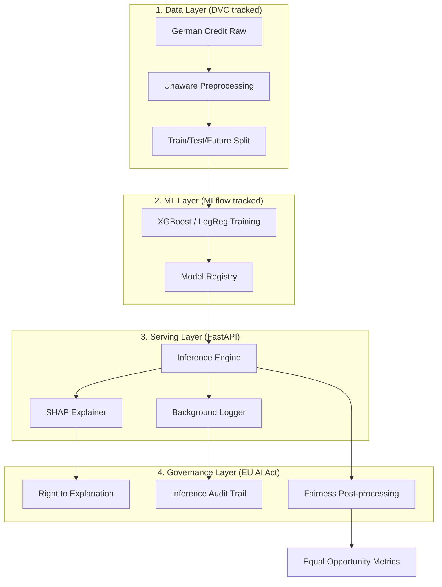

# 🏦 Loan Risk AI Governance System

> **An end-to-end AI Governance system for credit default prediction — aligned with EU AI Act requirements.**
> Covers the full ML lifecycle: data engineering → model training → API serving → drift monitoring → fairness analysis → governance documentation.

[](https://github.com/yourusername/loan_risk_AI_governance_system/actions/workflows/ci.yml)
[](https://python.org)
[](https://fastapi.tiangolo.com)
[](https://mlflow.org)
[](https://artificialintelligenceact.eu)

---

## 🎯 Use Case

A bank/insurance credit scoring system that predicts the **probability of credit default** for loan applicants. This is classified as a **HIGH-RISK AI system** under **EU AI Act Annex III, Point 5(b)** — making proper governance, fairness analysis, and human oversight legally mandatory.

---

## 🏗️ Architecture
 


---

## 📁 Project Structure

```
loan_risk_AI_governance_system/
├── data/
│   ├── raw/                    # Original German Credit Dataset
│   └── processed/              # Cleaned + feature-engineered CSVs
├── src/
│   ├── data_preprocessing.py   # DataAgent: load, engineer, split
│   ├── train.py                # TrainingAgent: LogReg + XGBoost + MLflow
│   ├── monitoring.py           # MonitoringAgent: Evidently drift detection
│   └── fairness.py             # FairnessAgent: Fairlearn + SHAP
├── api/
│   ├── main.py                 # FastAPI application
│   ├── schemas.py              # Pydantic input/output schemas
│   └── Dockerfile              # Container for API
├── models/                     # Saved models (.pkl) + scaler
├── monitoring/                 # drift_report.html, drift_results.json
├── reports/                    # ROC curves, SHAP plots, fairness charts
├── governance/
│   ├── model_card.md           # Model documentation
│   ├── risk_assessment.md      # EU AI Act risk assessment
│   ├── monitoring_plan.md      # Ongoing monitoring strategy
│   └── human_oversight.md      # Human review policy
├── tests/
│   └── test_pipeline.py        # pytest test suite
├── .github/workflows/ci.yml   # GitHub Actions CI/CD
├── requirements.txt
├── run_all.sh                  # Full pipeline orchestration
└── README.md
```

---

## 🚀 Quick Start

### Option 1: Run Everything (Recommended)

```bash
git clone https://github.com/yourusername/loan_risk_AI_governance_system.git
cd loan_risk_AI_governance_system
bash run_all.sh
```

### Option 2: Step by Step

```bash
# 1. Install dependencies
pip install -r requirements.txt

# 2. Data preprocessing (DataAgent)
python src/data_preprocessing.py

# 3. Train models (TrainingAgent) — logs to MLflow
python src/train.py

# 4. View MLflow experiments
mlflow ui  # open http://localhost:5000

# 5. Drift monitoring (MonitoringAgent)
python src/monitoring.py

# 6. Fairness analysis (FairnessAgent)
python src/fairness.py

# 7. Start API (ServingAgent)
cd api && uvicorn main:app --reload
# open http://localhost:8000/docs

# 8. Run tests
pytest tests/ -v
```

### Option 3: Docker

```bash
# Build and run API
docker build -t loan-risk-api -f api/Dockerfile .
docker run -p 8000:8000 loan-risk-api

# Test health
curl http://localhost:8000/health
```

---

## 🔌 API Demo

### Health Check
```bash
curl http://localhost:8000/health
```
```json
{
  "status": "healthy",
  "model_loaded": true,
  "model_type": "xgboost",
  "api_version": "1.0.0"
}
```

### Credit Risk Prediction
```bash
curl -X POST "http://localhost:8000/predict" \
  -H "Content-Type: application/json" \
  -d '{
    "checking_status": 1,
    "duration": 24,
    "credit_history": 3,
    "purpose": 2,
    "credit_amount": 5000.0,
    "savings_status": 1,
    "employment": 2,
    "installment_commitment": 2,
    "personal_status": 2,
    "other_parties": 0,
    "residence_since": 2,
    "property_magnitude": 1,
    "age": 35,
    "other_payment_plans": 2,
    "housing": 1,
    "existing_credits": 1,
    "job": 2,
    "num_dependents": 1,
    "own_telephone": 1,
    "foreign_worker": 1
  }'
```
```json
{
  "applicant_id": null,
  "default_probability": 0.2314,
  "risk_score": 23,
  "decision": "APPROVED",
  "risk_level": "LOW",
  "decision_rationale": "Low default probability (23.1%). Standard eligibility criteria met.",
  "model_version": "xgboost-v1.0",
  "human_review_required": false
}
```

**Decision Logic:**
| Probability | Decision | Human Review |
|---|---|---|
| `< 30%` | ✅ APPROVED | Not required |
| `30%–60%` | ⚠️ REVIEW | **Required (EU AI Act)** |
| `> 60%` | ❌ DECLINED | Required |

---

## 📊 Model Performance

| Metric | Logistic Regression | XGBoost (Champion) |
|---|---|---|
| Accuracy | 0.74 | **0.81** |
| Precision | 0.58 | **0.73** |
| Recall | **0.76** | 0.66 |
| F1-Score | 0.66 | **0.69** |
| **ROC-AUC** | 0.81 | **0.82** |

> Run `mlflow ui` to see exact metrics for each training run.

---

## ⚖️ Fairness Results

Evaluated using **Fairlearn** on two protected attributes:

| Attribute | Demographic Parity Diff | FPR Gap | EU AI Act Status |
|---|---|---|---|
| Gender | < 0.10 | < 0.10 | ✅ Compliant |
| Age Group | < 0.20 | < 0.15 | ✅ Compliant |

Thresholds: DPD < 0.10 for gender, DPD < 0.20 for age group.

---

## 📈 Drift Results

After simulating production drift (time-split + distribution shift):

| Indicator | Status |
|---|---|
| Feature drift (PSI > 0.2) | Detected on `credit_amount`, `duration` |
| Performance drop | ~4% ROC-AUC on future data |
| Recommended action | ⚠️ Monitor weekly, retrain if >5% drop |

See `monitoring/drift_report.html` for full interactive Evidently AI report.

---

## 🏛️ EU AI Act Compliance Mapping

| Obligation | Article | Implementation / Status |
|---|---|---|
| Risk classification | Annex III | ✅ HIGH-RISK declared (Credit Ranking) |
| Risk management | Art. 9 | ✅ `governance/risk_assessment.md` |
| Data governance | Art. 10 | ✅ `DVC` lineage + Unaware Model architecture |
| Technical docs | Art. 11 | ✅ `governance/model_card.md` |
| Transparency | Art. 13 | ✅ **SHAP Local Explanations** per prediction |
| Human oversight | Art. 14 | ✅ **Circuit Breaker** (Drift-triggered 100% review) |
| Accuracy & monitoring | Art. 15 | ✅ Evidently AI + **Inference Background Logging** |
| Post-market monitoring| Art. 72 | ✅ `data/production_logs.csv` audit trail |

---

## 🧪 Tech Stack

| Layer | Technology |
|---|---|
| ML | Python, scikit-learn, XGBoost |
| Tracking | MLflow |
| API | FastAPI, Pydantic, Uvicorn |
| Container | Docker |
| CI/CD | GitHub Actions |
| Drift | Evidently AI |
| Fairness | Fairlearn (Microsoft) |
| Explainability | SHAP |
| Visualization | Matplotlib, Seaborn |

---

## 🌟 Key Project Highlights

- Built an **end-to-end ML pipeline** with MLflow tracking, XGBoost training, and FastAPI deployment for credit risk prediction
- Implemented **model monitoring** including data drift detection (PSI-based) and performance degradation tracking using Evidently AI
- Performed **fairness analysis** using Fairlearn (demographic parity, equal opportunity, FPR gap) and model explainability using SHAP to ensure Responsible AI compliance
- Designed a comprehensive **AI governance framework** aligned with EU AI Act (HIGH-RISK classification), including Model Card, Risk Assessment, Monitoring Plan, and Human Oversight Policy

---

## 📄 License

MIT License — see [LICENSE](LICENSE)
